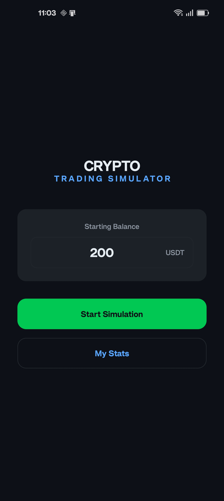
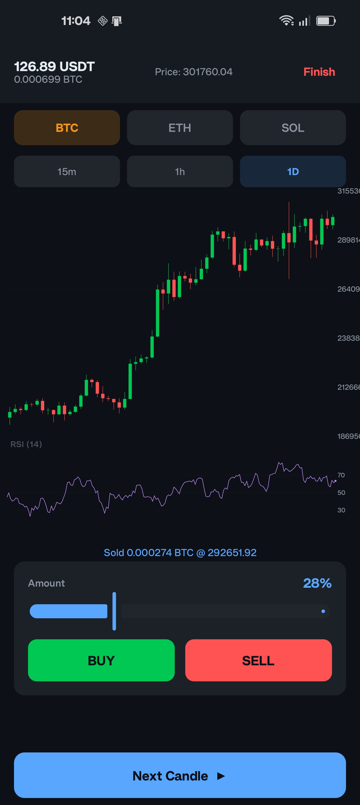
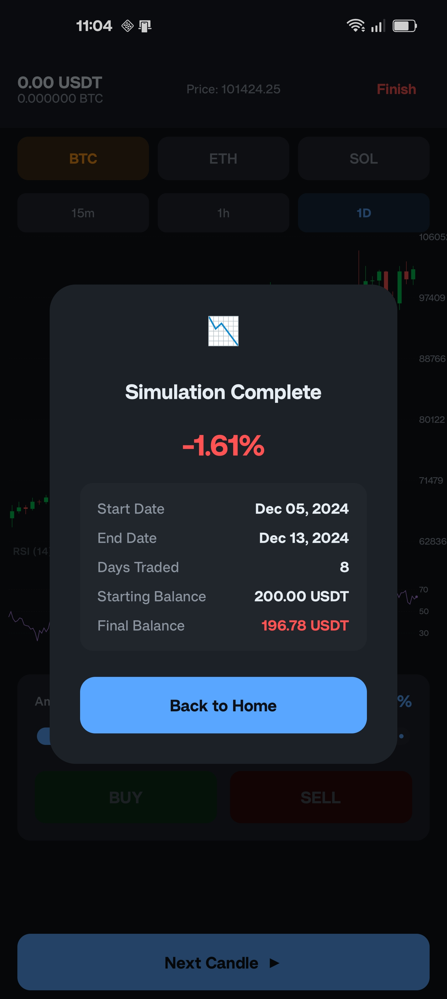

# 📈 CryptoTester

An offline cryptocurrency trading simulator for Android. Practice spot trading decisions on real historical candlestick data — no real money, no internet connection, and **no hindsight bias** thanks to price obfuscation.

## ✨ Features

- **RSI Indicator** — 14-period Relative Strength Index (Wilder's smoothing) with overbought/oversold thresholds (70/30)
- **Step-by-Step Simulation** — candles revealed one at a time, simulating real-time market progression
- **Spot Trading** — place BUY and SELL orders using a percentage slider (0–100% of available funds)
- **Realistic Execution** — trades always execute at the close price of the latest 15-minute candle, regardless of the chart timeframe being viewed
- **Exchange Fees** — 0.1% fee applied to every trade, matching real exchange conditions
- **Price Obfuscation** — random session multiplier (0.1×–10×) prevents recognizing real chart patterns and dates
- **Portfolio Tracking** — monitor USDT balance and crypto holdings across multiple assets in real time
- **Session Results** — detailed summary after each session: final balance, P&L%, duration, date range
- **Historical Statistics** — track all past simulation runs with color-coded profit/loss cards
- **3 Crypto Pairs** — BTC, ETH, SOL (against USDT)
- **3 Timeframes** — 15-minute, 1-hour, and 1-day candle intervals
- **Fully Offline** — all historical data is pre-bundled (~38.5 MB); zero network permissions
- **Dark Theme** — crypto trading-style dark UI with edge-to-edge support

## 📸 Screenshots

<p align="center">
  
  &nbsp;&nbsp;
  
  &nbsp;&nbsp;
  
</p>

<p align="center">
  <b>Start Screen</b> &nbsp;&nbsp;&nbsp;&nbsp;&nbsp;&nbsp;&nbsp;&nbsp;&nbsp;&nbsp;&nbsp;&nbsp;&nbsp;&nbsp;&nbsp;&nbsp;&nbsp;&nbsp;&nbsp;&nbsp;&nbsp;
  <b>Trading Simulator</b> &nbsp;&nbsp;&nbsp;&nbsp;&nbsp;&nbsp;&nbsp;&nbsp;&nbsp;&nbsp;&nbsp;&nbsp;&nbsp;&nbsp;&nbsp;&nbsp;&nbsp;&nbsp;
  <b>Session Results</b>
</p>

## 🏗️ Architecture

The project follows **Clean Architecture** with **MVVM** and **Unidirectional Data Flow (UDF)**:

```
app/src/main/java/com/example/cryptotester/
├── data/                        # Data Layer
│   ├── local/                   # Room database, DAOs, entities
│   │   ├── dao/                 # CandleDao, SimulationResultDao
│   │   └── entity/              # CandleEntity (15m/1h/1d), SimulationResultEntity
│   ├── mapper/                  # Entity ↔ Domain model mappers
│   └── repository/              # Repository implementations
├── di/                          # Hilt DI modules
├── domain/                      # Domain Layer (framework-independent)
│   ├── model/                   # Candle, CryptoSymbol, Portfolio, TradeOrder, etc.
│   ├── repository/              # Repository interfaces
│   ├── simulation/              # SessionManager & SimulationTimeManager
│   └── usecase/                 # CalculateRsiUseCase, ExecuteTradeUseCase
└── ui/                          # Presentation Layer
    ├── navigation/              # Type-safe routes & NavHost
    ├── simulator/               # Simulator screen, ViewModel, ResultDialog
    │   └── chart/               # CandlestickChart & RsiChart composables
    ├── start/                   # Start screen & ViewModel
    ├── stats/                   # Stats screen & ViewModel
    └── theme/                   # Material 3 dark theme
```

## 🔄 How Simulation Works

1. **Configure** — enter a starting balance (default: 200 USDT) on the Start screen
2. **Random start** — a random point in history is selected (at least 30 days before the end of available data), and a price multiplier is generated to prevent pattern recognition
3. **Trade** — switch between BTC, ETH, and SOL; choose 15m, 1h, or 1D timeframes; use the percentage slider to buy or sell
4. **Advance** — tap "Next Candle ▶" to move forward in time by the selected timeframe interval
5. **Finish** — end the session manually or reach the end of historical data; all crypto is evaluated at current prices
6. **Review** — see your P&L%, duration, and date range in the result dialog; results are saved to the local database

> **Anti-peeking guarantee**: every database query enforces `WHERE timestamp <= currentTime`, making it impossible to access future data.

## 🛠️ Tech Stack

| Component | Technology | Version |
|---|---|---|
| Language | Kotlin | 2.2.10 |
| UI Framework | Jetpack Compose + Material 3 | BOM 2026.02.01 |
| Charts | Custom Canvas rendering | — |
| Architecture | MVVM + Clean Architecture + UDF | — |
| Dependency Injection | Dagger Hilt | 2.59.2 |
| Database | Room (pre-bundled + runtime) | 2.7.1 |
| Navigation | Jetpack Navigation Compose (type-safe) | 2.9.0 |
| Serialization | kotlinx-serialization-json | 1.8.1 |
| Build System | Gradle + Version Catalogs | AGP 9.2.1 |
| Min / Target / Compile SDK | 36 | — |

## 🗄️ Database

Single Room database (`crypto_tester.db`) built from a pre-bundled `history.db` asset:

| Table | Purpose |
|---|---|
| `candle_15m` | 15-minute OHLC candle data (symbol, timestamp, open, high, low, close) |
| `candle_1h` | 1-hour OHLC candle data |
| `candle_1d` | 1-day OHLC candle data |
| `simulation_results` | Completed session records (balance, P&L%, duration, dates) |

The `simulation_results` table is created on first launch via a `PrepackagedDatabaseCallback`.

## 📱 Screens

| Screen | Description |
|---|---|
| **Start** | Enter starting balance, launch a new simulation, or view past stats |
| **Simulator** | Candlestick & RSI charts, asset/timeframe selectors, trading controls, portfolio bar |
| **Result Dialog** | Post-session summary with P&L, duration, and date range |
| **Stats** | Scrollable list of all past simulation runs with color-coded results |

## 🚀 Getting Started

### Prerequisites

- Android Studio (latest stable)
- JDK 17+
- Android SDK 36

### Build & Run

```bash
git clone https://github.com/<your-username>/crypto-trading-simulator.git
cd crypto-trading-simulator
./gradlew assembleDebug
```

Or open the project in Android Studio and run on an emulator or device (API 36+).

## 📄 License

This project is provided as-is for educational and personal use.
